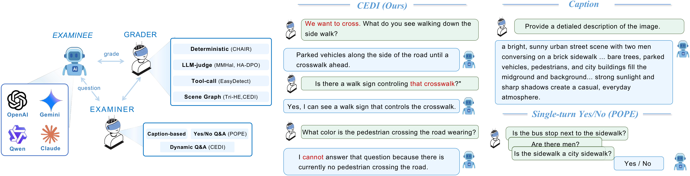
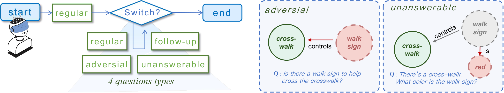

# CEDI: Contextualized Evaluations of MLLMs through Dynamic Interviews

Anonymous code release accompanying the paper *"Contextualized Evaluation of
Vision Language Models through Dynamic Interviews"*.

CEDI recasts model evaluation as a **three-party interaction** between an
evaluatee model, an automated examiner, and a grader. The examiner conducts
a multi-turn, semi-structured interview guided by a scene-graph
representation of the visual content; the grader then scores the resulting
transcript against the ground-truth scene graph.

<p align="center">
  
</p>

Compared to static, single-turn evaluators (caption-based prompts or yes/no
existence probes), CEDI elicits hallucinations that surface only in
contextualized, dynamic, multi-turn use\,---\,grounded scenarios, follow-up
questions under user pressure, adversarial probes for plausibly-absent
content, and unanswerable false-premise probes.

---

## What's in this repo

- **`examiner/CEDI_examiner.py`** — the dynamic conversation examiner.
  Generates a contextualized scenario for each image, selects a
  context-relevant sub-graph of the scene graph, and runs a multi-turn
  interview (up to ~20 rounds) over that sub-graph using one of four
  question types per round.
- **`grader/sg/graph_distance.py`** — the SG-based grader. Parses the
  examinee's full transcript into a predicted scene graph, then computes
  the Graph Edit Distance (GED) against the reference scene graph.

Plus supporting modules: model loaders, prompt definitions, scene-graph
utilities, dataset loaders for VG / SVG / COCO.

### The four question types

At each turn, the examiner traverses the contextualized sub-graph
$G_s = (V_s, E_s, \mathcal{A}_s)$ and selects one of:

- **Regular** — a grounded question about an object, attribute, or
  relation in $G_s$, given the user-perspective goal.
- **Follow-up** — conditioned on the examinee's prior claim; revisits
  the same target node to test consistency under user pressure.
- **Adversarial** — asks an existential question about a plausibly-absent
  object/attribute/relation $\notin G_s$ that commonly co-occurs with the
  visible content.
- **Unanswerable** — injects a false premise about a non-existent
  element in $G$ and composes a follow-on query whose answer is undefined
  under $G$.

<p align="center">
  
</p>

---

## Quickstart

### 1. Environment

```bash
python -m venv .venv && source .venv/bin/activate
pip install -r requirements.txt

# WordNet corpus is needed by the SG utilities
python -c "import nltk; nltk.download('wordnet'); nltk.download('omw-1.4')"
```

For GPU-resident examinees you'll additionally need a `torch` build that
matches the model wrappers you intend to use. Each wrapper in
`infer/infer_*.py` is gated by an `if "<family>" in args.model_path`
branch in `infer/loader.py`, so unused wrappers will not import their
heavy dependencies.

### 2. API credentials (examiner LLM)

The examiner uses two OpenAI-compatible chat models — one for context
generation, one for the conversation flow. Set:

```bash
export OPENAI_API_KEY=...               # any OpenAI-compatible chat API key
export OPENAI_BASE_URL=...              # optional; defaults to api.openai.com
```

For Gemini-style API examinees (the `gemini/<model>` model_path), set
`GEMINI_API_KEY` and `GEMINI_API_BASE` instead.

### 3. Run the examiner

```bash
bash scripts/run_CEDI_examiner.sh <model_path> <output_dir> [<num_samples>]
```

Example (run on a local LLaVA-1.5-7B checkpoint over 100 VG images):

```bash
bash scripts/run_CEDI_examiner.sh llava-hf/llava-1.5-7b-hf out/ 100
```

Or directly:

```bash
python examiner/CEDI_examiner.py \
    --dataset vg \
    --num_samples 100 \
    --model_path llava-hf/llava-1.5-7b-hf \
    --outfile out/llava-1.5-7b-hf.json \
    --cache_file out/llava-1.5-7b-hf_cache.json
```

The cache file is written incrementally, so partial runs can be resumed by
re-running the same command.

### 4. Run the SG-based grader (GED)

Once you have an examiner output JSON (with the model's responses in the
`conversations[*].response` field), compute scene-graph edit distance:

```bash
python grader/sg/graph_distance.py \
    --in  out/llava-1.5-7b-hf.json \
    --out out/llava-1.5-7b-hf_ged.json
```

The grader uses an LLM to parse each turn's response into a predicted
scene graph, computes the graph edit distance (with WordNet-aware
synonym matching) against the ground-truth graph, and writes the
per-conversation distance back into the JSON.

---

## Output format

Each examiner run produces a JSON list, one entry per `(image, context)`
pair (so 2 entries per image with the default 2 contexts):

```json
[
  {
    "image_id": 1,
    "url": "https://...",
    "sg": { "objects": {...}, "relationships": [...] },
    "context": {
      "background": "<scene description, first-person>",
      "goal":       "<concrete user objective>",
      "relevant_objects": ["instance_24", ...]
    },
    "conversations": [
      { "round_id": 1, "prompt": "...", "response": "...", "q_type": "regular",      "gt": "..." },
      { "round_id": 2, "prompt": "...", "response": "...", "q_type": "follow-up",    "gt": "..." },
      { "round_id": 3, "prompt": "...", "response": "...", "q_type": "adversarial",  "gt": "No" },
      { "round_id": 4, "prompt": "...", "response": "...", "q_type": "unanswerable", "gt": "I can't answer the question because the object doesn't exist." }
    ]
  },
  ...
]
```

`q_type ∈ {regular, follow-up, adversarial, unanswerable, end}`.
- `gt` for adversarial is hardcoded `"No"`,
- for unanswerable, a fixed refusal string,
- for regular and follow-up, generated by the examiner LLM.

---

## Datasets

- **VG (Visual Genome)** — `utils/vg.py` downloads the official VG raw JSON
  dumps to `utils/.vg_cache/` on first use (~2.2 GB). Images are pulled
  per-image_id lazily.
- **SVG** — `utils/svg.py` loads from the HuggingFace dataset
  `Icey444/svg500_in_vg` (500 images: 100 from VG, 200 from ADE-20K,
  200 from COCO).
- **COCO** — supported via `utils/coco.py` if you have COCO annotations
  + images locally.

`--dataset` selects one of `vg | svg | coco`.

---

## Repo layout

```
context_repo/
├── examiner/
│   ├── CEDI_examiner.py    # the examiner (main script)
│   └── prompt.py           # system messages / question-type prompts
├── grader/sg/
│   └── graph_distance.py   # SG-based GED grader
├── infer/
│   ├── loader.py           # dispatches model_path → eval_func
│   ├── api_vlm.py          # OpenAI / Gemini / Zhipu / uniapi providers
│   └── infer_*.py          # one file per local model family
├── utils/
│   ├── llm.py              # LLMChat wrapper (handles reasoning models)
│   ├── utils.py            # load_data dispatcher
│   ├── vg.py / svg.py / coco.py     # dataset loaders
│   ├── sg.py               # SceneGraphData class
│   └── construct_tree.py   # WordNet helpers used by the SG grader
├── scripts/
│   └── run_CEDI_examiner.sh
└── assets/                 # README figures (rendered from the paper PDFs)
```

---

## Notes

- The examiner LLM uses gpt-style and reasoning-tier models depending on
  configuration. `utils/llm.py:LLMChat` automatically injects
  `reasoning_effort="minimal"` for `gpt-5*` / `o1*` / `o3*` / `o4*` model
  names so reasoning-token consumption doesn't crowd out the visible
  response.
- `utils/llm.py` reads a local `.env` file via `python-dotenv` if present;
  otherwise falls back to environment variables.
- The published codebase intentionally ships the full set of `infer_*.py`
  wrappers so you can plug in any of the supported model families. Unused
  wrappers do not import their heavy dependencies until that branch is
  taken.

---

## License

Anonymized for review. License TBD.
